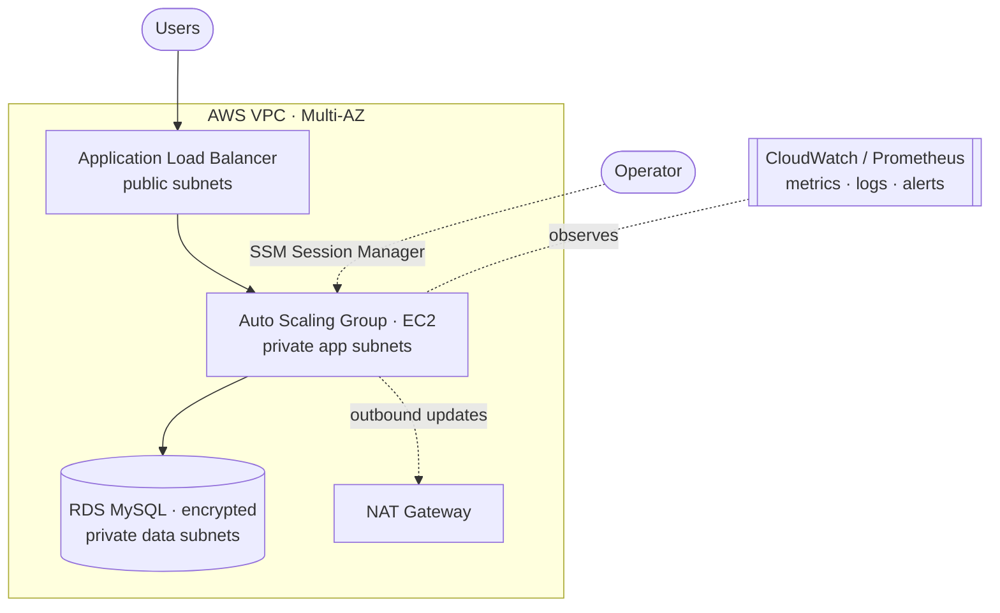

<!-- ============================= HERO ============================= -->

<h1>Hi, I'm Debjit Sarkar</h1>

<h3>DevOps &amp; Cloud Engineer · Infrastructure Automation · Reliability Engineering</h3>

I build repeatable, secure, and observable cloud infrastructure — 
provisioned as code, deployed through pipelines, and monitored by default.

  
  
  
  
  
  

---

## About

I focus on cloud infrastructure and the automation around it. My work and learning center on:

- **Provisioning AWS infrastructure with Terraform** — networks, compute, databases, and IAM defined as reusable, version-controlled code.
- **Containerizing applications with Docker** and deploying workloads to **Kubernetes** (Helm / Kustomize).
- **Designing repeatable CI/CD pipelines** so builds, tests, scans, and deployments run the same way every time.
- **Applying security checks throughout the lifecycle** — image and IaC scanning, least-privilege IAM, and secrets management.
- **Improving observability and reliability** — metrics, dashboards, alerting, and faster troubleshooting.
- **Exploring AI-assisted DevOps workflows** — using coding agents to help with infrastructure development, testing, and incident investigation, always under human review before high-impact changes.

> These are my areas of focus and active learning, demonstrated through the practical projects below.

---

## Technical Stack

**Cloud &amp; Infrastructure**

**Containers &amp; Orchestration**

**CI/CD &amp; Version Control**

**Monitoring &amp; Reliability**

**Security &amp; DevSecOps**

**Programming &amp; Automation**

**AI-Assisted Engineering**

Icons indicate tools I use or am actively learning — not a claim of expert-level mastery in each.

---

## Featured Projects

### ☁️ [aws-two-tier-terraform](https://github.com/deba310984/aws-two-tier-terraform)
A highly-available, multi-AZ AWS architecture provisioned end to end as code.

- **Problem it solves:** stands up a production-style, load-balanced application tier with a private, encrypted database tier — reproducibly, without manual console clicks.
- **Key tech:** Terraform, AWS (VPC, ALB, Auto Scaling, EC2, RDS MySQL, IAM), SSM Session Manager.
- **Engineering decisions:** database kept in private subnets with encryption at rest; operator access via **SSM Session Manager instead of SSH** (no open port 22); least-privilege security groups; infrastructure validated with Terraform's native testing.
- 📖 [Read the implementation →](https://github.com/deba310984/aws-two-tier-terraform#readme)

### 🧩 [aws-terraform-modules](https://github.com/deba310984/aws-terraform-modules)
A composable Terraform module library that builds the *same* AWS network cheaply for dev and highly-available for prod — from one codebase, no copy-paste.

- **Problem it solves:** eliminates duplicated infrastructure code between environments while keeping dev cheap (single NAT) and prod resilient (per-AZ NAT).
- **Key tech:** Terraform (reusable VPC &amp; Security Group modules), AWS, GitHub Actions.
- **Engineering decisions:** rule-driven security-group module reused across tiers; environment-specific composition (dev = 2 AZs / single NAT, prod = 3 AZs / per-AZ NAT); **CI validation** on every change via GitHub Actions.
- 📖 [Read the implementation →](https://github.com/deba310984/aws-terraform-modules#readme)

### 🚀 [trendforge_ai](https://github.com/deba310984/trendforge_ai)
A cloud-native application with a full infrastructure and delivery setup around it.

- **Problem it solves:** demonstrates packaging and operating a multi-service workload the cloud-native way — containers, orchestration, pipelines, and monitoring.
- **Key tech:** Docker Compose, Kubernetes (Helm &amp; Kustomize, HPA, NetworkPolicy), GitHub Actions, Trivy image scanning, Prometheus &amp; Grafana, Terraform (AWS VPC / EKS / RDS / IAM).
- **Engineering decisions:** CI pipeline runs lint, tests, **Trivy image scanning**, and Kubernetes manifest validation; workloads ship with autoscaling and network policies; observability wired in via the Prometheus Operator.
- 📖 [Explore the repo →](https://github.com/deba310984/trendforge_ai#readme)

### 🔁 [CodeAlpha_Project1](https://github.com/deba310984/CodeAlpha_Project1)
A containerized web app with an end-to-end CI/CD pipeline to the cloud.

- **Problem it solves:** shows an automated path from commit to a running, hosted application.
- **Key tech:** Node.js, Docker, Azure Container Registry, Azure App Service, Azure DevOps Pipelines.
- **Engineering decisions:** build once as a container image, push to a registry, and deploy to a managed host through an automated pipeline rather than manual uploads.
- 📖 [Read the implementation →](https://github.com/deba310984/CodeAlpha_Project1#readme)

Also exploring upstream cloud-native security tooling through forks of
<a href="https://github.com/deba310984/trivy">Trivy</a> and
<a href="https://github.com/deba310984/kyverno">Kyverno</a>, and Docker fundamentals in
<a href="https://github.com/deba310984/CodeAlpha_Web_Server_Docker">CodeAlpha_Web_Server_Docker</a>.

---

## Reference Architecture

A representative view of the HA two-tier pattern I provision with Terraform (see `aws-two-tier-terraform`):

---

## Engineering Principles

| Principle | What it means in practice |
| --- | --- |
| **Infrastructure as Code** | Everything reproducible from version-controlled Terraform — no manual console drift. |
| **Least privilege &amp; secure defaults** | Scoped IAM, private data tiers, encryption on, no unnecessary open ports. |
| **Automated validation** | Lint, plan, test, and scan in CI before anything reaches an environment. |
| **Observable systems** | Metrics, dashboards, and alerts that point to actionable problems. |
| **Repeatable deployments** | Pipeline-driven releases with a rollback path in mind. |
| **Cost awareness** | Right-sized resources and cleanup — e.g. single NAT for dev, per-AZ only in prod. |
| **Human-in-the-loop AI** | AI-assisted changes to infrastructure always get human review before they ship. |

---

## GitHub Activity

Stats are rendered by a third-party service (github-readme-stats); if a card is slow to load, refresh the page.

---

## Contact

  
  
  <!-- Add your verified LinkedIn URL below, then uncomment this badge:
  
  -->

Infrastructure as code · automation as a habit · reliability as the goal.

