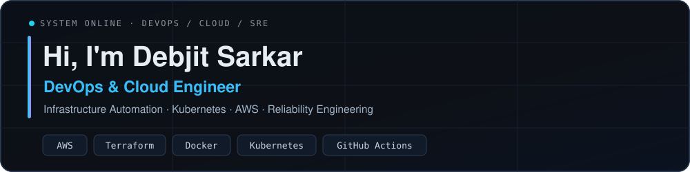
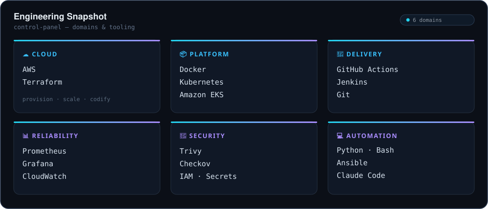
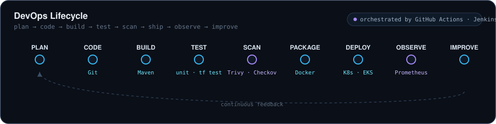
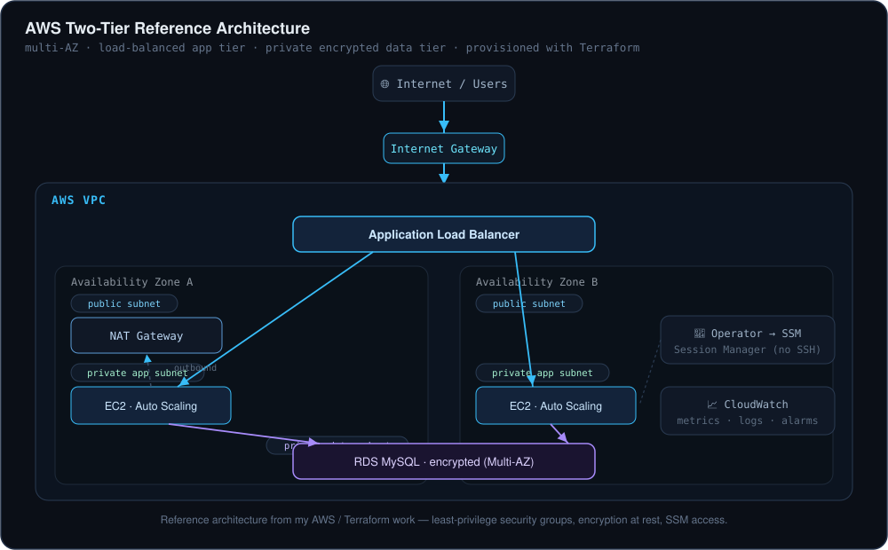
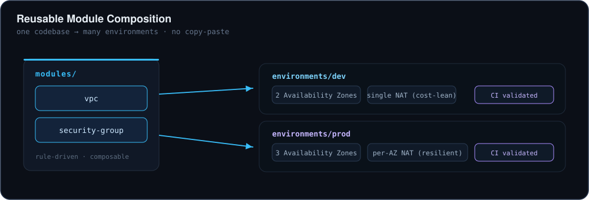
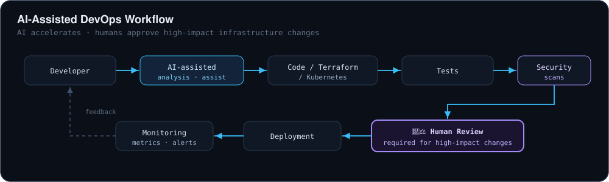

<!-- ╔══════════════════════════════ HERO ══════════════════════════════╗ -->

  
  
  

> Building repeatable, secure, and observable cloud infrastructure — provisioned as code, delivered through pipelines, and monitored by default.

---

<!-- ═══════════════════════ 2 · ENGINEERING SNAPSHOT ═══════════════════════ -->
## ⬢ Engineering Snapshot

---

<!-- ═══════════════════════ 3 · DEVOPS LIFECYCLE ═══════════════════════ -->
## ⬢ DevOps Lifecycle

---

<!-- ═══════════════════════ 4 · CLOUD ARCHITECTURE ═══════════════════════ -->
## ⬢ Cloud Architecture

Reference architecture from my AWS / Terraform work — a highly-available, multi-AZ design with a load-balanced application tier and a private, encrypted database tier.

Diagram built from <a href="https://github.com/deba310984/aws-two-tier-terraform"><code>aws-two-tier-terraform</code></a> — click to open the repository.

---

<!-- ═══════════════════════ 5 · FEATURED PROJECTS ═══════════════════════ -->
## ⬢ Featured Projects

<table>
<tr>
<td width="50%" valign="top">

### ☁️ aws-two-tier-terraform
A highly-available, multi-AZ AWS architecture provisioned end to end as code.

**Stack:** `AWS` · `Terraform` · `ALB` · `ASG` · `RDS` · `IAM` · `SSM`

**Engineering**
- Database in private subnets, encrypted at rest
- Operator access via **SSM Session Manager** — no open SSH
- Least-privilege security groups; validated with Terraform tests

<a href="https://github.com/deba310984/aws-two-tier-terraform">Repository</a> ·
<a href="https://github.com/deba310984/aws-two-tier-terraform#readme">Docs</a> ·
<a href="#-cloud-architecture">Architecture ↑</a>

</td>
<td width="50%" valign="top">

### 🧩 aws-terraform-modules
A composable module library — the *same* network, cheap for dev and resilient for prod, from one codebase.

**Stack:** `Terraform` · `AWS` · `VPC` · `Security Groups` · `GitHub Actions`

**Engineering**
- Reusable, rule-driven VPC & security-group modules
- Dev = single NAT (cost-lean); prod = per-AZ NAT (resilient)
- CI validation on every change

<a href="https://github.com/deba310984/aws-terraform-modules">Repository</a> ·
<a href="https://github.com/deba310984/aws-terraform-modules#readme">Docs</a>

</td>
</tr>
<tr>
<td colspan="2">

</td>
</tr>
<tr>
<td width="50%" valign="top">

### 🚀 trendforge_ai
A cloud-native application with a full infrastructure and delivery setup around it.

**Stack:** `Docker` · `Kubernetes` · `Helm` · `GitHub Actions` · `Trivy` · `Prometheus` · `Terraform/EKS`

**Engineering**
- CI runs lint, tests, **Trivy** scan, and K8s manifest validation
- Workloads ship with autoscaling and network policies
- Observability wired in via the Prometheus Operator

<a href="https://github.com/deba310984/trendforge_ai">Repository</a> ·
<a href="https://github.com/deba310984/trendforge_ai#readme">Docs</a>

</td>
<td width="50%" valign="top">

### 🔁 CodeAlpha_Project1
A containerized web app with an end-to-end CI/CD pipeline to the cloud.

**Stack:** `Node.js` · `Docker` · `Azure Container Registry` · `Azure App Service` · `Azure DevOps`

**Engineering**
- Build once as an image, push to a registry, deploy to a managed host
- Automated pipeline instead of manual uploads

<a href="https://github.com/deba310984/CodeAlpha_Project1">Repository</a> ·
<a href="https://github.com/deba310984/CodeAlpha_Project1#readme">Docs</a>

</td>
</tr>
</table>

Also exploring upstream cloud-native security tooling through <strong>forks</strong> of <a href="https://github.com/deba310984/trivy">Trivy</a> and <a href="https://github.com/deba310984/kyverno">Kyverno</a>, and Docker fundamentals in <a href="https://github.com/deba310984/CodeAlpha_Web_Server_Docker">CodeAlpha_Web_Server_Docker</a>.

---

<!-- ═══════════════════════ 6 · TECH ECOSYSTEM ═══════════════════════ -->
## ⬢ Tech Ecosystem

**☁ Cloud**
&nbsp;

**🏗 Infrastructure**
&nbsp;

**📦 Containers &nbsp;·&nbsp; ☸ Orchestration**
&nbsp;

**🔄 CI/CD**
&nbsp;

**📊 Observability**
&nbsp;

**🔐 Security / DevSecOps**
&nbsp;

**💻 Automation / Languages**
&nbsp;

**🤖 AI-Assisted Engineering**
&nbsp;

Icons indicate tools I use or am actively learning — not a claim of expert-level mastery in each.

---

<!-- ═══════════════════════ 7 · AI-ASSISTED DEVOPS ═══════════════════════ -->
## ⬢ AI-Assisted DevOps

How AI fits into my workflow — used to accelerate **codebase analysis, infrastructure drafting, test generation, documentation, and incident investigation**, always behind a human-review gate for high-impact infrastructure changes. No claim of autonomous production operation.

---

<!-- ═══════════════════════ 8 · ENGINEERING PRINCIPLES ═══════════════════════ -->
## ⬢ Engineering Principles

| Principle | In practice |
| :-- | :-- |
| **Infrastructure as Code** | Everything reproducible from version-controlled Terraform — no console drift. |
| **Secure by default** | Private data tiers, encryption on, no unnecessary open ports. |
| **Least privilege** | Scoped IAM roles and tight, rule-driven security groups. |
| **Automated validation** | Lint, plan, test, and scan in CI before anything reaches an environment. |
| **Observable systems** | Metrics, dashboards, and alerts that point to actionable problems. |
| **Repeatable deployments** | Pipeline-driven releases with a rollback path in mind. |
| **Cost awareness** | Right-sized resources and cleanup — single NAT for dev, per-AZ only in prod. |
| **Human-in-the-loop AI** | AI-assisted infrastructure changes always get human review before they ship. |

---

<!-- ═══════════════════════ 9 · GITHUB ACTIVITY ═══════════════════════ -->
## ⬢ GitHub Activity

Secondary context only — rendered by github-readme-stats; refresh if a card is slow to load. Explore the work directly at <a href="https://github.com/deba310984?tab=repositories">github.com/deba310984</a>.

---

<!-- ═══════════════════════ 10 · CONTACT ═══════════════════════ -->
## ⬢ Contact

  
  
  <!-- Add your verified LinkedIn URL below, then uncomment this badge:
  
  -->

<code>Infrastructure as Code</code> · <code>Automation</code> · <code>Reliability</code>

